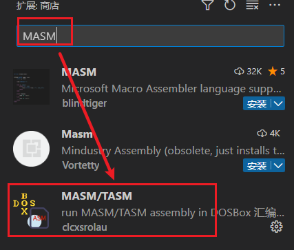
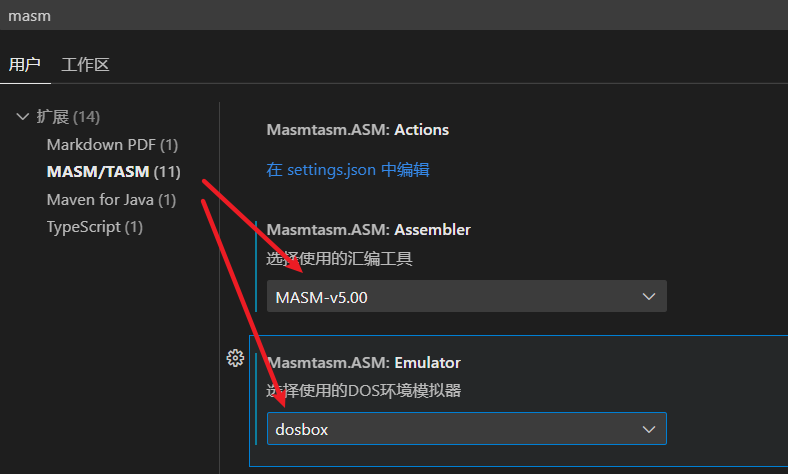
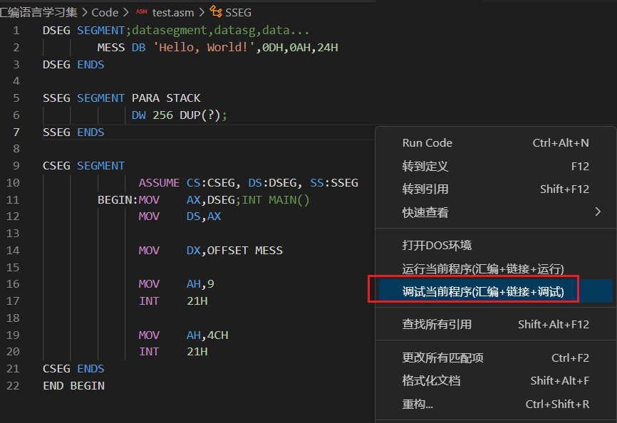
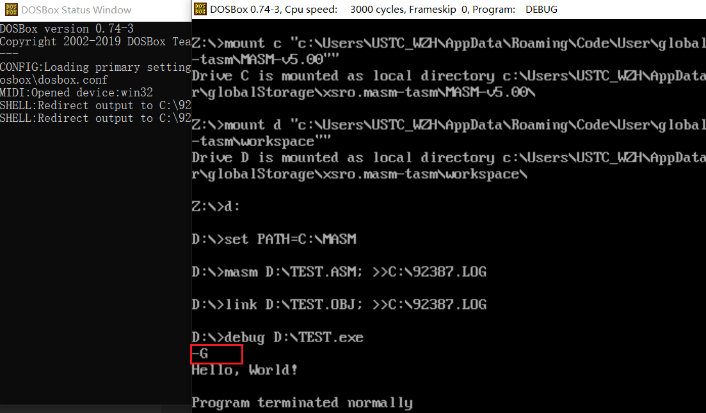

# 一.学习资源来源
## 视频及资料
https://www.bilibili.com/video/BV1KG411T77D/?spm_id_from=333.788&vd_source=73483520149242b72151daa86462d16b


# 二.环境准备
## 1.扩展安装


## 配置项设置



# 三.第一行汇编代码
## 代码
```assembly
DSEG SEGMENT;datasegment,datasg,data...
        MESS DB 'Hello, World!',0DH,0AH,24H
DSEG ENDS

SSEG SEGMENT PARA STACK
             DW 256 DUP(?);
SSEG ENDS

CSEG SEGMENT
              ASSUME CS:CSEG, DS:DSEG, SS:SSEG
        BEGIN:MOV    AX,DSEG;INT MAIN()
              MOV    DS,AX
              
              MOV    DX,OFFSET MESS

              MOV    AH,9
              INT    21H

              MOV    AH,4CH
              INT    21H
CSEG ENDS
END BEGIN
```

## 效果

